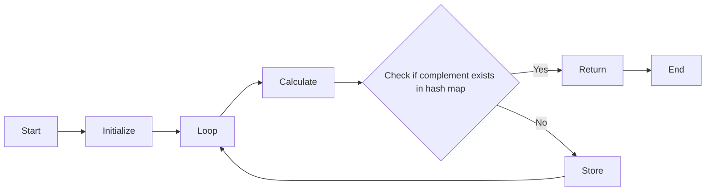

# Two Sum

## Problem Statement

Given an array of integers `nums` and an integer `target`, return indices of the two numbers such that they add up to `target`.
You may assume that each input would have exactly one solution, and you may not use the same element twice. You can return the answer in any order.

## Constraints

- `2 <= nums.length <= 10^4`
- `-10^9 <= nums[i] <= 10^9`
- `-10^9 <= target <= 10^9`

## Approach 1: Using a Hash Map

**Time Complexity:** O(n)

This approach has linear time complexity because we iterate through the array once and perform constant-time operations (such as checking if an element exists in the hash map).

### Flowchart

